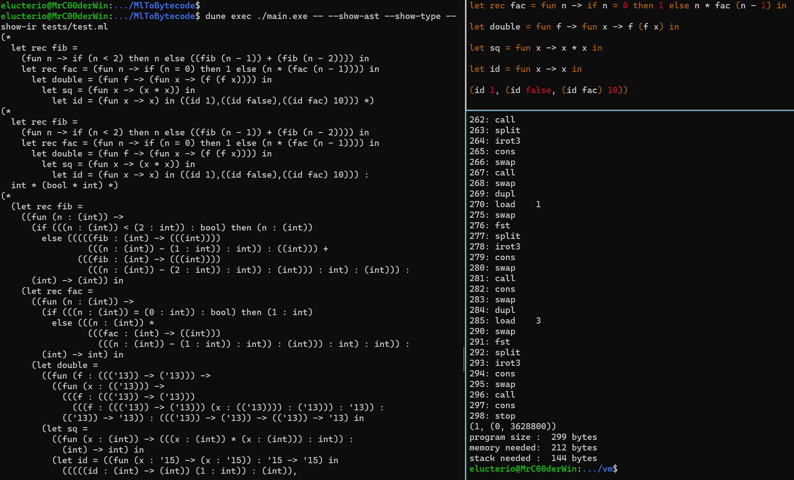

to build
```bash
dune build
```
to execute
```bash
dune exec ./main.exe -- --show-ast --show-type --show-ir --show-bc tests/test.ml
```

to execute with the vm
```bash
cd vm
cmake .
make
./vm ../tests/test.bc
```

Videos to walk you through the code:

* [Overview, lexer and parser](https://youtu.be/F9MhBISX10s)
* [Type inference](https://youtu.be/bTvyqp4hu-c)
* [IR semantic](https://youtu.be/BfbEPpfuOiw)
* Ast to IR (coming soon)
* IR to bytecode (coming soon)
* Virtual machine (coming soon)


